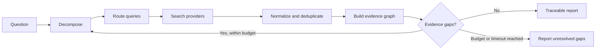

<p align="center">
  
</p>

<h1 align="center">SourceLoom</h1>

<p align="center">
  <strong>Adaptive, evidence-first deep research across multiple search providers.</strong>
</p>

<p align="center">
  Search broadly. Identify what is missing. Follow the evidence. Stop for an explicit reason.
</p>

<p align="center">
  <a href="LICENSE">Apache-2.0 License</a> ·
  <a href="docs/architecture.md">Architecture</a> ·
  <a href="CONTEXT.md">Domain glossary</a>
</p>


> [!IMPORTANT]
> **Current status: foundation and design.** SourceLoom does not yet provide a working research engine. Provider integrations, the adaptive loop and benchmarks are the next implementation milestones. The roadmap below distinguishes shipped work from planned work.

## The problem

Most “multi-provider research” tools concatenate search results and ask an LLM to summarize them:

```text
Tavily results + Exa results → LLM summary
```

That can produce a fluent answer without showing whether important claims are supported, whether sources are independent, or why the search stopped.

SourceLoom is being built around a stricter question:

> **What evidence is still missing, and which search action is most likely to find it?**

## The proposed research loop



Search providers are inputs—not the product. The core product is the loop that plans, routes, evaluates evidence and decides whether another search wave is justified.

## Evidence-Gap Search

The initial algorithm is a hypothesis to test, not a claim of novelty.

1. Decompose the question into answerable claims.
2. Generate targeted queries for each unsupported claim.
3. Route queries to provider adapters such as Tavily and Exa.
4. Normalize documents and remove duplicate or near-duplicate evidence.
5. Connect claims to supporting and contradicting sources.
6. Rank unresolved evidence gaps by expected value.
7. Search again only when a gap is worth the remaining budget.
8. Stop with either supported conclusions or explicit unknowns.

Every research run should preserve enough information to answer:

- Which query produced this source?
- Which source supports this claim?
- Did an independent source corroborate it?
- Was contradictory evidence found?
- Why did the system continue or stop searching?

## Intended architecture

```text
Question
  └─ Research planner
      ├─ Provider router
      │   ├─ Tavily adapter
      │   └─ Exa adapter
      ├─ Document normalizer
      ├─ Evidence graph
      ├─ Contradiction detector
      ├─ Gap prioritizer
      └─ Stopping policy
          ├─ Coverage reached
          ├─ Budget exhausted
          └─ Timeout reached
```

The engine will remain provider-independent. Provider-specific responses will be converted into a common result contract before scoring or synthesis.

## Evaluation plan

SourceLoom will not be labelled “better” because its reports look convincing. The adaptive strategy will be compared against explicit baselines.

| Dimension | What will be measured |
|---|---|
| Claim support | Proportion of material claims linked to relevant evidence |
| Citation correctness | Whether the cited passage actually supports the claim |
| Source quality | Primary-source use, authority and independence |
| Contradictions | Whether conflicting evidence is surfaced rather than hidden |
| Coverage | Whether required aspects of the question were addressed |
| Efficiency | Queries, documents, latency and model/search cost |
| Stopping behaviour | Whether the run stopped for a recorded, valid condition |

Initial comparison:

```text
Tavily only
Exa only
Naive Tavily + Exa merge
SourceLoom adaptive Evidence-Gap Search
```

A small validation set will be used before any larger benchmark. Pilot thresholds and budgets will be treated as tunable hypotheses.

## Roadmap

- [x] Define the problem, vocabulary and evidence-first architecture
- [x] Create the public project identity and repository foundation
- [ ] Specify the provider-neutral search contract
- [ ] Implement Tavily and Exa adapters with recorded fixtures
- [ ] Implement URL and content deduplication
- [ ] Build the first claim-to-source evidence graph
- [ ] Add bounded iterative gap search
- [ ] Produce a cited JSON and Markdown report
- [ ] Benchmark against single-provider and naive-merge baselines
- [ ] Expose the engine as an MCP tool for agents such as Hermes

## Planned interface

The command below documents the target developer experience; it is **not implemented yet**.

```bash
sourceloom research \
  "Can a ChatGPT subscription fund third-party API usage?" \
  --providers tavily,exa \
  --max-search-waves 3 \
  --report markdown
```

Expected output characteristics:

- cited conclusions;
- unresolved questions;
- contradictory evidence;
- search decisions and stopping reason;
- machine-readable run trace.

## Repository model

- `main`: stable public state and accepted milestones
- `develop`: integration branch for reviewed work
- `feat/*`, `fix/*`, `docs/*`: short-lived branches merged through pull requests

Branches exist to make changes reviewable—not to manufacture activity.

## Principles

- **Evidence before prose.** A polished sentence is not a verified claim.
- **Primary sources first.** Important factual constants should come from authoritative sources.
- **Unknown is a valid result.** Missing evidence must remain visible.
- **Every loop is bounded.** Query, cost, time and iteration limits are explicit.
- **Provider independence.** Tavily and Exa are adapters, not architectural dependencies.
- **Reproducible evaluation.** Improvements must beat a recorded baseline.

## License

Licensed under the [Apache License 2.0](LICENSE).
