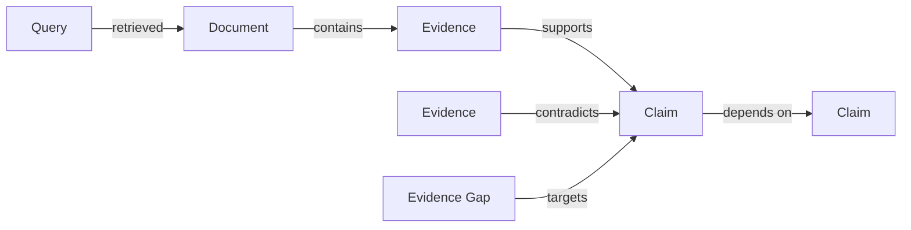

# Architecture direction

SourceLoom is an evidence-first deep-research engine. This document records the intended boundaries before implementation begins.

## Core pipeline

```text
ResearchQuestion
  → QuestionDecomposer
  → EvidenceGapQueue
  → QueryPlanner
  → ProviderRouter
  → SearchProvider adapters
  → DocumentNormalizer
  → DuplicateDetector
  → EvidenceExtractor
  → EvidenceGraph
  → StoppingPolicy
  → ReportBuilder
```

## Boundary rules

1. Search providers return candidates; they do not establish truth.
2. Provider-specific fields stop at the adapter boundary.
3. Claims and evidence remain separate from generated narrative.
4. Reports are projections of a stored research trace.
5. Every recursive or iterative operation receives a hard budget.
6. Side effects and model calls must be observable in the run trace.

## Provider contract

The first implementation milestone will define a provider-neutral contract around these concepts:

```text
SearchRequest
  query
  requested_count
  time_range (optional)
  domain_constraints (optional)

SearchResult
  canonical_url
  title
  excerpt
  published_at (optional)
  provider
  provider_rank
  raw_reference
```

This is a design sketch, not a frozen API. Tests will define the executable contract before production code is added.

## Evidence graph

The first graph does not require a dedicated graph database. Its conceptual relationships are:



Storage technology remains an implementation decision. The domain model must not depend on it.

## Stopping conditions

A run may stop because:

- required claims reached the configured evidence standard;
- the query budget was exhausted;
- the document budget was exhausted;
- the model/search cost cap was reached;
- the run timeout was reached;
- no new useful evidence was found.

Stopping because of a limit does not convert unresolved claims into conclusions.

## First vertical slice

The first executable slice should answer one narrow research question using recorded provider fixtures and produce:

1. normalized results;
2. one claim linked to supporting evidence;
3. one unresolved evidence gap;
4. an explicit stopping reason;
5. a machine-readable trace.

Live API calls come only after the deterministic path is tested.
